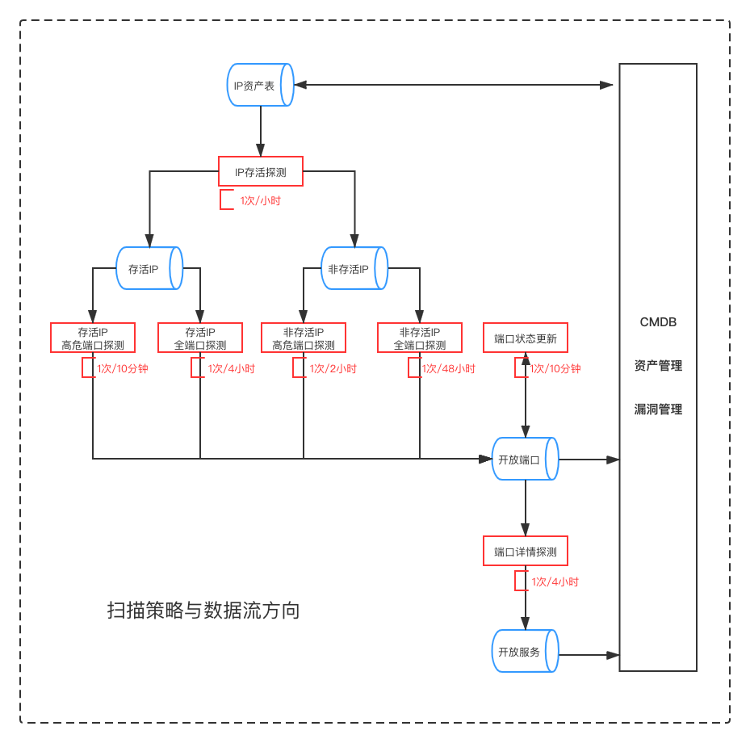
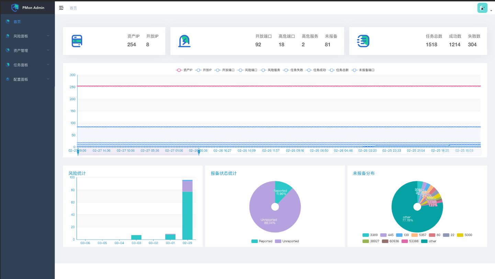
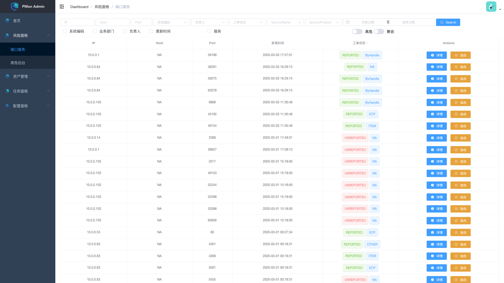
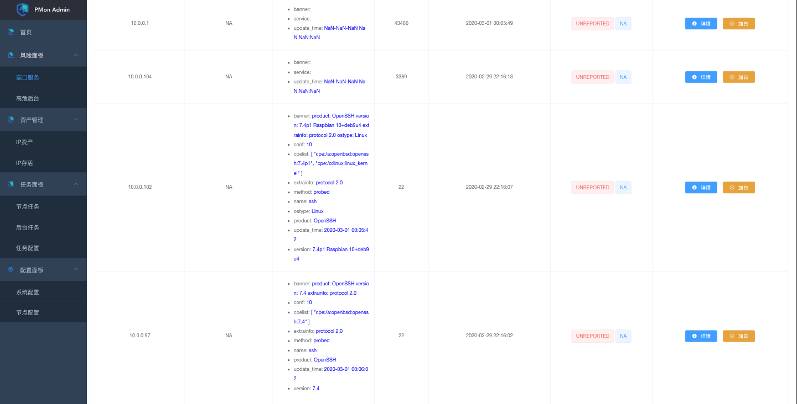
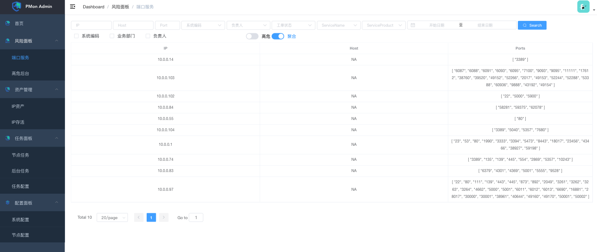
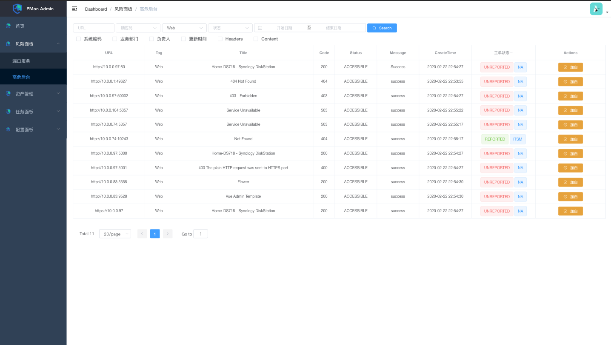
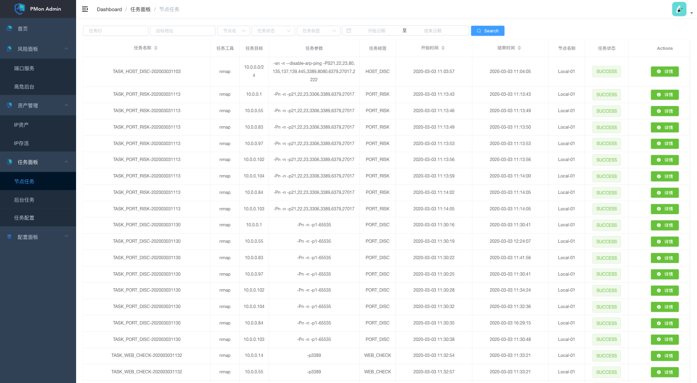
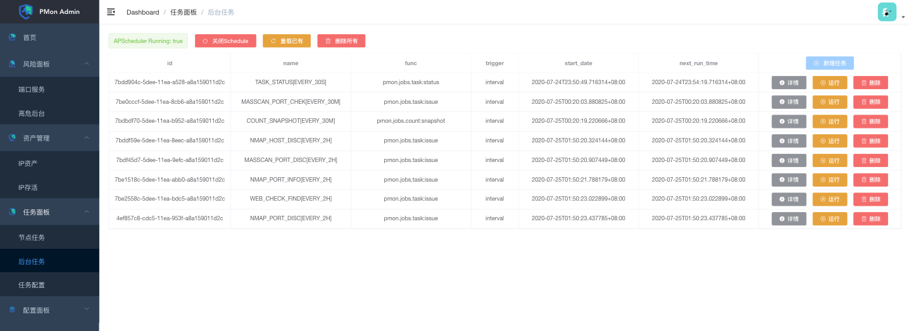
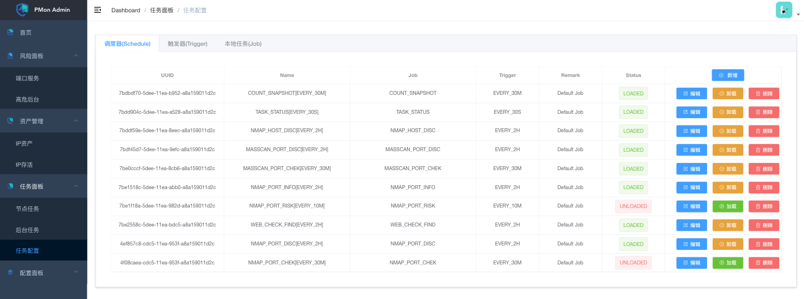

## 1. 前言

通常一个企业都会有相当数量的互联网开放端口，这些端口承载着企业对外发布的应用，也是安全防护的第一道战线，作为安全运营人员，守好边界端口是基本要素。

一般情况下，企业会在IDC边界部署四层的传统防火墙，这些防火墙能够将绝大部分的非必要的端口开放在互联网上。随着大部分企业开始上云，在云端更多的是依赖于云服务供应商提供的“安全组”来实现端口防护。

从实际运营的经历来看，即使企业内部存在防火墙和云上的“安全组”，也会存在内部端口异常开放在公网的情况，这更多的原因是由于开发运维人员缺乏安全意识或者配置策略没有做好。在大的企业，资产及管理使用资产的相关人员数量增多，不可控的因素增多，如果相应的IT流程管理不规范严谨，就导致意外对外开放的端口服务数量不可控，例如一个配置的公网IP的主机不小心就启动了一个监听在0.0.0.0的redis服务，或者一个防火墙的误操作，都有可能将风险暴露。往往当安全人员发现高危的端口开放在互联网上，或者是SRC白帽子上报的，甚至已经被入侵后才发现的，此时风险就变成了真正的损失。

对于端口开放这种低级问题，有的人认为，管理手段比技术手段更容易解决这个问题，例如，通过规范严格流程管理、严厉的处罚措施来控制这种风险；个人觉得管理手段更依赖安全部门的在企业内部的重视程度以及与运维开发配合的紧密程度，如果没有上述条件，就很难达到理想的效果。从安全运营角度来看，技术手段的监控和感知能力是从另外一个角度来审视整体的安全风险，即使安全管理上已经有相应的规范来约束，但在技术上，还是应该做好监控，以确保即使安全管理出现偏差情况，也能及时发现风险。

通常情况下，正常开放的业务的应用，会做比较严格安全限制，但非正常业务的服务，或者说非预期的应用端口应用暴露在公网上，就是整个防护体系的一道巨大的口子，对于攻击者来说，找到一个防备很弱的服务甚至没有设防护手段的服务端口，是最容易突破的，也是成本最低的；对于防守方来说，能够防护服务端口，也是成本最低，最具投资收益比的。

因此，在技术层面非常有必要对边界端口进行动态监控，达到能够实时发现端口开放状态，能够及时感知边界变化情况，及时制止端口开放的高风险行为，可以大大缩减企业暴露的风险面，将风险控制在可接受的范围内。

## 2. 资产管理

在有些企业内部，往往会将资产管理代替端口监控，其实这是两个不同的安全维度。

首先，资产管理不是端口监控。端口是一个持续变化的过程，变动频率会远大于主机资产的变动频率，资产管理侧重于资产收集，更关注企业内部资产信息完整性和准确性，因此资产扫描频率会比较低，时效性比较低。

在攻防对战中，“信息差”和“时间差”是非常重要的两个角度，作为防守方，应该尽可能掌握边界资产变化情况，充分利用自有资产更全面信息不对等来应对攻方的单点突破；防守方比攻击者能够更快发现暴露风险，就具备更多的优势，掌握更大主动权。以资产管理的低时效性来发现端口，就很可能会丧失主动权优势。

另外，端口监控也是资产管理一部分。如果能够及时感知端口变化，也可以提高资产管理效率，尤其是边界资产管理效率，在应对0day漏洞爆发时，也可以快速响应，及时梳理风险暴露情况。

因此，端口监控应该是一种持续的安全状态监控，就好比运维工程师需要时刻关注监控服务器的CPU和内存使用率，安全运营人员也必须时刻关注边界的端口开放状态，及时对风险进行处置。

## 3. 监控策略

理论上，每一个端口就是风险，只不过在特定业务场景和特定的安全防护条件下，有些风险是可以接受的，有些端口的风险是不可接受的。因此，可以对端口做以下简单的分类：

* 风险端口：开放在公网上的端口，这些端口可能是业务正常需要，也可能是不合规的端口；
* 高危端口：开放在公网上的极度危险的端口，例如数据库类端口、FTP端口、VNC端口，这些端口是不被允许的；
* 高危服务：开放在非标准端口的高危服务，例如MySQL服务开放在非标准的3307端口上；

端口监控，就是对IP和端口监控，每IP最多可以有65535端口，要做到及时端口变化的感知，最简单的做法不外乎就是不间断对全端口扫描实现监控。这里最大的问题是，需要很大的主机和网络资源来满足这种扫描的动作。例如，最夸张的做法，有多少个IP就申请多少台主机，每个主机扫描一个IP的65535端口，持续不间断的扫。这样当然可以做到监控的效果，但在现实情况中不可能出现。

那如何在有限的资源情况下保证能够最快速度发现变化的风险呢？

实际运营过程中，通常会使用`时效性`和`覆盖率`两个指标来评价监控系统。`时效性`是指在可以在多长时间内感知状态的变化，感知时间越短越好；`覆盖率`是指监控资产覆盖范围，可监控的范围越广越好。在一定监控资源的情况下，这两个指标很难同时满足，如果为了保证了`时效性`，在监控时就必须考虑怎么尽可能保证快速完成扫描，就很难保证大而全的`覆盖率`；同理，如果为了保证`覆盖率`，就必须考虑如何尽可能把所有端口都被扫描到，这种很费时间的扫描任务就很难保证`时效性`；就好比在程序开发中，`空间`和`时间`的关系，要么用`空间`换`时间`，或者用`时间`换`空间`。

因此，对不同的风险级别的端口，其监控目标自然不同。

1. `高危端口`越快发现越好，时效性要求最高，覆盖率要求次之；
2. `高危服务`要尽快发现，时效性要求中等，覆盖率要求中等；
3. `风险端口`要能够发现，时效性要求次之，覆盖率要求最高；

之所以这样划分等级是有原因的，通常情况下，高危端口是高危服务开在默认端口上，例如MySQL开在3306上，Redis开在6379上，这些暴露在公网上默认端口，无时无刻不被各种自动化攻击脚本扫描着，就是说一旦暴露公网，极容易被发现被攻破，作为防守方要尽最大可能性尽快发现且妥善处置，所以要求时效性最高。其次，对于高危服务和风险端口，虽然风险也高，但攻击者要发现这些风险，也需要耗费相当的成本资源，因此对这两类，要能够及时发现更重要。关于时效性和覆盖率，下文会详细阐述。

### 3.1 时效性

影响`时效性`指标，主要有`监控目标数`和`监控复杂度`两个变量。

* 监控目标数
  检测目标数有被监控的IP数和被监控的端口数组成，显而易见的有以下几种情况：

    * IP资产数 > 存活IP数 > 可被检测到的IP： 可使用IP资产数量大于实际使用的IP数量，如果存在防火墙，真正可被探测到主机数量还会再少；
    * 理论可开放端口数 > 实际开放端口数: 理论上每IP可开放65535个端口，真实环境中不可能存在开放所有端口的情况；
    * 实际开放端口数 > 高危端口数: 未必每个端口都是高危端口，仅有部分需要处理的；但所有开放的端口都需要被审计的，以确保都是安全的。

* 检测复杂度
  检测复杂度是需要对端口进行详细探测的程度，例如：`探测10.0.0.1的80端口开放状态`与`探测10.0.0.1的80端口的服务进程信息`所占用的资源是不同，后者显然占更多的资源，耗时也更长。

简单粗暴的可以用以下这个公式表示：

`耗时 = 监控目标数 * 监控复杂度 / 可用资源`

因此，在可用资源一定的情况下，要提高`时效性`，降低耗时，就必须降低`监控目标数`和`监控复杂度`;

### 3.2 覆盖度

覆盖率主要受限于以下几个条件：

1. 被资产清单的准确度，例如CMDB中记录的IP数据是否准确且及时更新；
2. 被监控的端口是否覆盖全端口，即1~65535端口；
3. 被监控端口服务的指纹库准确度，这依赖于扫描器的指纹库；

因此，要提高`覆盖度`就必须要考虑上述几点。

### 3.3 任务粒度

要做好端口监控，要达成`时效性`和`覆盖率`目标，就必须将具体任务细粒化，在不同阶段执行不同要求的任务，最后将不同任务组合将不同任务合理组合起来，达成动态监控目标。

于是，根据风险类别，可以有以下几种细粒度的任务：

| 序号 | 任务名               | 输入     | 任务耗时 | 输出     | 描述                             |
| :--- | :------------------- | -------- | -------- | -------- | -------------------------------- |
| 0    | IP存活探测           | IP资产   | 一般     | 存活IP   | 从IP资产中发现存活的主机         |
| 1    | 全端口探测           | 存活IP   | 长       | 开放端口 | 从存活的IP中进行全端口探测       |
| 2    | 高危端口探测         | 存活IP   | 短       | 高危端口 | 仅对存活IP探测高危的端口         |
| 3    | 端口服务检测         | 开放端口 | 长       | 端口服务 | 仅对开放的端口进行服务探测       |
| 4    | 端口状态监控         | 开放端口 | 一般     | 开放端口 | 持续更新已发现端口状态           |
| 5    | 高危后台             | 开放端口 | 一般     | 高危后台 | 从开放的端口发现高危后台         |
| 6    | 非存活IP高危端口探测 | 非存活IP | 长       | 开放端口 | 非存活IP的高危端口探测，兜底策略 |
| 7    | 非存活IP全端口探测   | 非存活IP | 非常长   | 开放端口 | 非存活IP的全端口探测，兜底策略   |
| 8    | 全资产全端口探测     | IP资产   | 非常长   | 开放端口 | 全资产的全端口检测，兜底策略     |

### 3.4 任务调度

上述是围绕`时效性`和`覆盖度`两个指标而设计的，具有最小任务粒度，是最小执行单元；
有的任务可能不是最终结果，但是为下一个任务提供输入，这些输入能够尽可能降低扫描`资源`,来保证`时效性`，提高效率；
任务之间调度，可以用以下这张图来表示：

上图所展示的扫描策略只是一个例子，扫描频率可以根据实际情况调整，如上图所述，高危端口最快可以在10分钟内发现，最坏的情况下也可以在2小时内发现。

通过既定的策略执行之后，监控数据在各任务之间动态流动，既保证`时效性`要求，也满足`覆盖率`需要。

这样设计有以下几个好处。

1. 任务是解耦的，任一任务失败都不会导致监控时效；
2. 任务是最小粒度化，代码实现可以降低复杂度，提高代码健壮性；
3. 任务调度可以根据监控需要灵活调度；
4. 整个监控的数据流是可见的，可以灵活调用任一任务的结果；

### 3.5 小结

监控策略，需要评估自身对安全监控需求，分析端口监控全过程并将其细粒化任务，分析每种任务核心目标，并根据需求组合，在全局实现监控策略的目标。

## 4. 风险闭环

执行完上面的策略，是能够快速发现端口了，但运营的工作还没有结束，甚至可以说才真正的开始，就是要及时把风险闭环。

在运营中，又有两个指标，叫MTTD（平均发现时间）和MTTR（平均处理时间），上述的策略能够降低MTTD，但不能解决MTTR。

要降低MTTR就需要尽可能将所有处理的过程标准化、流程化，然后通过技术手段自动化，甚至都将整个体系工程化。可以通过以下四点来体现：

1. 资产匹配
2. 通知整改
3. 报备审批
4. 主动控制

### 4.1 资产匹配

对于发现的风险，首先要能够找到风险点出现在哪个系统，其对应的Owner或运维是谁，并能够及时将风险信息自动同步至他们。这就是对扫描出来的结果能够自动且正确找到对应的资产信息；但这往往在实际运营过程中会很痛苦，最重要的原因是CMDB信息不准确。

CMDB信息准确性似乎是每个公司的通病，需要系统、网络、架构等相关IT部门协力完善，但这不是一件容易的事情。这样导致的结果是运营人员望着一堆风险端口，且找不到处理人的尴尬场面。

如果想要尽可能避免这个问题，有一个思路就是尽可能获取公司内各业务系统、工单流程等涉及IT资产相关信息的获取接口，或API或数据库。例如有一个内网IP始终在CMDB找不到正确的Owner，可以试试从“服务器资源申请流程工单“这类的数据库中去捞这个IP，运气好的话，在工单中能找到当时资源初始化时分配的这个IP，那就可以找到对应的Owner。同理，公司内还会有很多类似的工单或系统，记录着资产的信息，如果能够聚合起来，甚至为这些数据做成一个统一的接口，这样每次匹配资产就通过这个接口匹配，就可以提高资产匹配的准确率和时效性。

一句话，资产匹配说起来很简单，但做起来不是一件容易的事。

### 4.2 通知告警

当获取到责任人后，就可以通知，告知风险，对于高危的端口，甚至应该升级成安全事件，此时就需要对应的通知告警能力。
通常情况下，可以使用邮件、IM，部分企业也有统一的告警发送，那么就需要自动化调用告警接口推送告警。

端口告警很容易导致广播风暴。例如一个新上的IP，没有做好端口管控，起了一批端口服务，一旦扫描器发现就会全部推送告警，这就导致。因此在上线告警之前，需要对告警策略做一些优化。例如可以做一些聚合，相同IP的不同端口的多条告警聚合成一条告警，又或者多次告警之间的间隔不得少于多长的时间窗口。

### 4.3 主动控制

Owner找到了，告警通知也发了，那如果没有处理怎么办呢？
因此，安全运营最好具备一些主动控制的权限或能力，如果风险较大，而Owner又无法及时处理的情况，可以执行一些强制手段。例如通过防火墙规则下发规则临时关闭端口，或者通过Agent下发强制关闭端口的命令；
主动控制最好不要做成自动化的，如果是自动化也要在某个环节有人参与的节点，因为这个比较容易误伤，要是自动化程序脚本出个bug什么的分分钟钟会影响业务。

### 4.4 报备审批

前面几个都是检测后的处理，最好的方式还是在被检测前就做好必要的风险防御。开放的端口都是风险，既然是风险就要评估风险，做到风险在可接受的范围，报备审批是一个最好的评估过程。

这个过程需要业务方的负责人知晓，也需要安全运营的人员的评估，通过报备审批的流程可以明确告知业务方风险，使其妥善对待开放业务，明确安全责任，也可以让后者提前知晓风险级别，做好必要的风险预估。

报备审批流程之后，需要将IP和端口信息及时同步到数据库，这样就成了白名单。在产生告警时，通过与白名单的匹配，也可以降低告警的频率和误报可能性。

### 4.5 收敛

当监控体系刚建立起来的时候，会遇到上述的几个问题，尤其是扫描出一堆无人认领的风险端口而不知所措。随着流程逐渐完善，自动化程度提高、报备流程走上正轨，在野的风险端口就会越来越少，达到收敛的效果。

## 5. 系统实现

要满足上述的监控策略，市面上能看到的，或偏向于资产管理，或偏向于漏洞扫描，这种动态持续化监控的产品，还没有找到一个比较称心如意的，于是只好自己造轮子。

### 5.1 系统需求

端口监控运营是一个动态化持续监控处理的过程，检测结果具备动态更新的能力，最好是设定策略后后台自动执行，运营人员只要直接看结果就好了，这也就要求系统具备定时执行的能力；

其次，边界涉及的IP资产量可能会很大，单一的扫描节点在性能上无法满足快速检测需要；另外，不同IP地址段会由于网段不通原因而无法互通，也要求检测的程序可以分布在不同的地方；因此需要将执行扫描任务的程序解耦出来，作为一个可分布式部署的节点，在后台统一下发检测任务，检测任务的结果统一发回后台处理，在将任务结果按照预定义格式更新到数据库中；

还有，实际运营过程中，除了要保证日常监控需要，也要应对某些特殊的批量测试场景；例如，`一个临时上线的IP地址段需要快速检测是否有高危端口`；这就要求系统具备一定扩展能力，

最后，还要有一个可视化界面，可以不精美，但要能用，总不能每次看结果都去数据库跑一次检索语句吧。

综上，系统设计主要考虑以下几个方面：

1. 支持定时任务执行，考虑扩展性，动态执行的任务可以自定义输出参数；
2. 扫描节点支持分布式部署，支持统一管理界面；
3. 任务节点解耦，支持动态任务，满足批量下发任务，也可支持单一任务下发；
4. 模块直接支持动态调用，提高功能的扩展性和灵活性；
5. 具有可视化界面，具备配置任务、任务查看结果、快速检索等基本功能；

### 5.2 框架选择

作为一个安全运营人员，Python是最好的选择，简单易懂，第三方库丰富，可以很快上手；前端就使用VueJs，算是比较简单，看个入门视频，加上开源框架支持，做几个简单页面也是很Easy的；数据库选择Mongodb，虽然内存泄露的问题还不是太会解决，但增删改查的语句与MySQL对比起来还是比较方便，且结果是json格式，与Python和Javascrip的VueJs也契合比较好，使用起来也比较顺手；模块之间的调用，RPC不太会，就用Restful好了，Flask框架也够强大，这种小项目也够了。

于是就有了以下清单：

数据库:

- Mongodb： 系统主要数据库;

后台服务：

- Flask：Python轻量级Web开发框架，提供基础Web功能； 
- flask-restful： Flask的Restful Api插件，实现后台Api与节点之间的通讯；
- APScheduler：Python任务调度模块，实现后台任务管理、节点任务定时下发功能；
- gunicorn：Python WSGI服务，用于部署Flask应用;
- Supervisor: 后台进程管理服务，用于保证后台服务持续运行； 

任务节点：

- Celery： 分布式任务队列，实现节点任务执行；
- Flower： Celery组件，实现Celery节点监控以及任务下发和监控的Web Api；
- Redis: Key-Value数据库，Celery任务管理存储调度；

前端框架：

- vue-element-admin: 基于Vue和element的前端开发框架，实现系统可视化展示；

### 5.3 任务调度设计

监控系统核心是任务调度，任务调度分两部分，一个是分发，一个是执行；

任务分发在系统后台根据配置的策略下发到对应节点执行，执行任务的节点收到任务后，执行任务，在任务结束后主动将结果推送到目标；
同时，后台定时刷线任务执行情况，跟踪任务状态，在接收任务到结果后，存储到数据库；

控制台使用Apscheduler定时执行下发任务，主要有以下几个参数：

* 触发器(Trigger): 配置定时参数;
* 任务(Job): 在预定时间执行的任务函数主体，以及任务相关的参数；
* 调度器(Scheduler): 触发器(Trigger) + 任务(Job) ，简单说就是定义了“在什么时候应该执行什么任务”

示意图如下：

### 5.4 任务节点

任务节点是真正执行任务的Celery Worker，底层扫描程序可以调用snmp或masscan，前者胜在扫描信息丰富，但扫描时长较长，后者详细程度不够，但扫描速度够快。

任务节点Celey Worker接收到任务后，根据任务参数，执行相应的任务， 执行完任务后，将任务结果通过Api形式推送会控制端，控制端对任务结果进行规范化处理并入Mongodb数据库。

为便于数据流动，在后台预定义数据标签，在下发任务时，指定相应标签即可快速下发任务目标，可以降低运维复杂度。数据源标签可以分成以下几种类：

* IP_ASSETS: IP地址资源，可以是IP段或单独的IP地址；
* IP_ONLINET: 存活的IP主机，这个数据是主机探测后生成；
* IP_OFFLINE: 不存活的IP主机，这个数据是主机探测后生成；
* PORT_OPEN: 执行任务时候开放的端口；
* PORT_DOWN: 执行任务时关闭的端口；

### 5.5 系统演示

1. **监控面板**：暂时还做的比较简单，展示基本情况。

监控面板主要显示发现的风险数、风险分类，以及任务执行情况；

2. **端口详情**： 展示目前正在开放的端口

端口详情尽可能显示所有详情，既要有基本的状态，也要有服务信息、资产信息、报备信息，也可以直接加白操作；同时，界面上还需要提供聚合功能，能够根据IP聚合后查看。这些功能都是为了更方便运营人员更快处理发现的风险；

服务详情：

聚合端口:

3. **高危后台**:  快速找到风险后台

高危后台是为了发现组件的后台管理Web，这些Web管理后台风险非常大，却又是非常容易被疏忽的风险；

4. **IP存活**: 

查看IP资产的存活情况，这是最简单的存活探测；

5. **任务状态**: 查看任务执行情况

整个监控系统中，任务状态是重要一项，要尽可能确保任务都是正常执行的，只有任务正常，监控的结果才正常；

6.  **后台任务**: 查看任务分配情况

查看任务分配情况，可以对任务调度执行进行调整；

7. **任务配置**: 配置具体任务参数

在此页面配置具体的任务参数。

### 5.6 代码实现

代码就不贴了，免得丢人，如果有兴趣的小伙伴，可以关注微信公众号回复“端口监控”，可以获取GitHub地址；

## 6. 后记

端口监控，简单说就是扫描，看似简单，其实是一个大坑，简单点说有这几点：

- 端口扫描容易，持续发现不易；
- 端口发现容易，流程跟进不易；
- 风险发现容易，风险闭环不易；

正因为存在这些问题，正是因为曾经踩过的坑，才有了这篇文章。

这是在做端口运营的时候一点小思路，欢迎各位大佬指导指导。

如果对您有帮助，还请关注、点赞、在看，素质三连哦。

